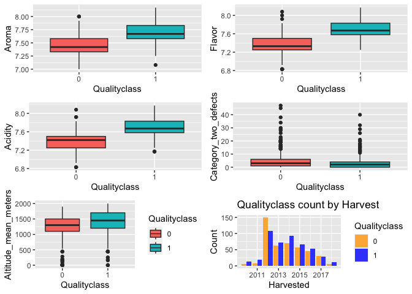

Groupwork2
================
2023-03-15

``` r
library(tidyverse)
library(readxl)
library(gridExtra)
library(ggplot2)
```

<<<<<<< HEAD
# Data Introduction

This data come from the Coffee Quality Database (CQD). The database
contains information from the CoffeevQuality Institute which is a
non-profit organisation working internationally to improve the quality
of coffee and thelives of the people who produce it. Each of the 5
datasets contain information on features of coffee and its production,
includinan overall score of quality. • *country_of_origin* – Country
where the coffee bean originates from. • *aroma* – Aroma grade (ranging
from 0-10) • *flavor* – Flavour grade (ranging from 0-10) • *acidity* –
Acidity grade (ranging from 0-10) • *category*\_two_defects – Count of
category 2 type defects in the batch of coffee beans tested. •
*altitiude_mean_meters* – Mean altitude of the growers farm (in metres)
• *harvested* – Year the batch was harvested • *Qualityclass* – Quality
score for the batch (Good - ≥ 82.5, Poor - \<82.5).

# Data Cleaning

First clear the null lines in the data, and then delete all lines with
the line name *Taiwan* since *Taiwan* is not a country.
=======
    ## ── Attaching core tidyverse packages ──────────────────────── tidyverse 2.0.0 ──
    ## ✔ dplyr     1.1.0     ✔ readr     2.1.4
    ## ✔ forcats   1.0.0     ✔ stringr   1.5.0
    ## ✔ ggplot2   3.4.1     ✔ tibble    3.1.8
    ## ✔ lubridate 1.9.2     ✔ tidyr     1.3.0
    ## ✔ purrr     1.0.1     
    ## ── Conflicts ────────────────────────────────────────── tidyverse_conflicts() ──
    ## ✖ dplyr::filter() masks stats::filter()
    ## ✖ dplyr::lag()    masks stats::lag()
    ## ℹ Use the ]8;;http://conflicted.r-lib.org/conflicted package]8;; to force all conflicts to become errors
>>>>>>> 60034cc38bd34d98f2c386aeafe4e9aa75ac47e6

``` r
coffee.data <- read.csv("/Users/sunyazhu/Desktop/University of Glasgow/R program/AllDatasetsR/coffee.csv")
coffee <- na.omit(coffee.data)
coffee<- subset(coffee, country_of_origin != 'Taiwan')
coffee
```

Using Qualityclass as a classification variable, assign Qualityclass 0
and 1 in terms of it’s original value poor and good.

``` r
coffee$Qualityclass <- as.integer(coffee$Qualityclass == "Good")
coffee
```

A subset with reasonable data distribution is selected from
*coffee.data’s* data set and stored in a new data set, *coffee*.

``` r
quantiles_aroma <- quantile(coffee.data$aroma,probs=c(0.25,0.75),na.rm=FALSE)
IQR_aroma <- IQR(coffee$aroma)
Lower_aroma <- quantiles_aroma[1]-1.5*IQR_aroma
Upper_aroma <- quantiles_aroma[2]+1.5*IQR_aroma
coffee<- subset(coffee,coffee$aroma>Lower_aroma & coffee$aroma< Upper_aroma)

quantiles_flavor <- quantile(coffee$flavor,probs=c(0.25,0.75),na.rm=FALSE)
IQR_flavor <- IQR(coffee$flavor)
Lower_flavor <- quantiles_flavor[1]-1.5*IQR_flavor
Upper_flavor <- quantiles_flavor[2]+1.5*IQR_flavor
coffee<- subset(coffee,coffee$flavor>Lower_flavor & coffee$flavor< Upper_flavor)

quantiles_acidity <- quantile(coffee$acidity,probs=c(0.25,0.75),na.rm=FALSE)
IQR_acidity <- IQR(coffee$acidity)
Lower_acidity <- quantiles_acidity[1]-1.5*IQR_acidity
Upper_acidity <- quantiles_acidity[2]+1.5*IQR_acidity
coffee<- subset(coffee,coffee$acidity>Lower_acidity & coffee$acidity< Upper_acidity)
coffee
```

Store the cleared data

``` r
write.csv(coffee,file="/Users/sunyazhu/Desktop/University of Glasgow/R program/AllDatasetsR/coffee_clean.csv",row.names=FALSE)
```

# Standardized data

``` r
## Creates a logical vector that determines which columns in the data box coffee contain numeric data. It uses the function sapply to determine whether the data type of each column is numeric.
numeric_cols <- sapply(coffee,is.numeric)
## The columns containing only numerical data in data box coffee are extracted and assigned to new data box numeric_coffee
numeric_coffee <- coffee[,numeric_cols]
## A new data box scaled_coffee is obtained by standardizing numerical data in numeric_coffee. The standardization process is to transform the data range of different variables into the same scale for easy comparison.
scaled_coffee <- as.data.frame(scale(numeric_coffee))
## Add the category_two_defects column from the original data box coffee to scaled_coffee.
scaled_coffee$category_two_defects <- coffee$category_two_defects
## Assign the numerical data in the standardized data frame scaled_coffee back to the corresponding column in the original data frame coffee, and overwrite the original data.
coffee[,numeric_cols] <- scaled_coffee
coffee
```

# Correlation test between variables

    ##                            aroma      flavor      acidity category_two_defects
    ## aroma                 1.00000000  0.67160282  0.538079249          -0.19698110
    ## flavor                0.67160282  1.00000000  0.705622108          -0.23495703
    ## acidity               0.53807925  0.70562211  1.000000000          -0.16888150
    ## category_two_defects -0.19698110 -0.23495703 -0.168881503           1.00000000
    ## altitude_mean_meters -0.03490461 -0.02777236 -0.006467399          -0.02396095
    ## harvested            -0.03412132  0.04100676  0.047885262          -0.13277330
    ## Qualityclass          0.59321981  0.66766788  0.604611195          -0.14226533
    ##                      altitude_mean_meters   harvested Qualityclass
    ## aroma                        -0.034904613 -0.03412132   0.59321981
    ## flavor                       -0.027772358  0.04100676   0.66766788
    ## acidity                      -0.006467399  0.04788526   0.60461119
    ## category_two_defects         -0.023960951 -0.13277330  -0.14226533
    ## altitude_mean_meters          1.000000000  0.07402986  -0.05075134
    ## harvested                     0.074029856  1.00000000   0.03792407
    ## Qualityclass                 -0.050751344  0.03792407   1.00000000

# Data visualization

``` r
## Numeric variables are converted to factor variables
coffee.clean$Qualityclass <- factor(coffee.clean$Qualityclass)
plot1 <- ggplot(data = coffee.clean,aes(x = Qualityclass, y = aroma, fill = Qualityclass)) +
  geom_boxplot() +
  labs(x = "Qualityclass", y = "Aroma") + 
  theme(legend.position = "none")

plot2 <- ggplot(data = coffee.clean,aes(x = Qualityclass, y = flavor, fill = Qualityclass)) +
  geom_boxplot() +
  labs(x = "Qualityclass", y = "Flavor") + 
  theme(legend.position = "none")

plot3 <- ggplot(data = coffee.clean,aes(x = Qualityclass, y = acidity, fill = Qualityclass)) +
  geom_boxplot() +
  labs(x = "Qualityclass", y = "Acidity") + 
  theme(legend.position = "none")

plot4 <- ggplot(data = coffee.clean,aes(x = Qualityclass, y = category_two_defects, fill = Qualityclass)) +
  geom_boxplot() +
  labs(x = "Qualityclass", y = "Category_two_defects") + 
  theme(legend.position = "none")

plot5 <- ggplot(data = coffee.clean,aes(x = Qualityclass, y = altitude_mean_meters, fill = Qualityclass)) +
  geom_boxplot() +
  labs(x = "Qualityclass", y = "Altitude_mean_meters") + 
  ylim(0,2000)
  theme(legend.position = "none")
```

    ## List of 1
    ##  $ legend.position: chr "none"
    ##  - attr(*, "class")= chr [1:2] "theme" "gg"
    ##  - attr(*, "complete")= logi FALSE
    ##  - attr(*, "validate")= logi TRUE

``` r
## The number of different quality inspection results in each year
plot6 <- ggplot(coffee.clean, aes(x=harvested, fill=as.factor(Qualityclass))) +
  geom_bar(position="dodge", alpha=0.8, stat="count") +
  scale_fill_manual(values=c("Orange", "Blue")) +
  labs(x="Harvested", y="Count", fill="Qualityclass") +
  ggtitle("Qualityclass count by Harvest")

## Merge six charts
## Arrange plot1 to plot6 in a grid of 2 rows and 3 columns
grid.arrange(plot1, plot2, plot3, plot4, plot5, plot6, nrow=3, ncol=2)
```

    ## Warning: Removed 24 rows containing non-finite values (`stat_boxplot()`).

<!-- -->

# Modeling

    ## Analysis of Deviance Table
    ## 
    ## Model 1: Qualityclass ~ aroma + flavor + acidity
    ## Model 2: Qualityclass ~ aroma * flavor + acidity
    ## Model 3: Qualityclass ~ aroma + flavor * acidity
    ## Model 4: Qualityclass ~ aroma * acidity + flavor
    ## Model 5: Qualityclass ~ aroma * flavor + aroma * acidity
    ## Model 6: Qualityclass ~ aroma * flavor + acidity * flavor
    ## Model 7: Qualityclass ~ aroma * acidity + flavor * acidity
    ## Model 8: Qualityclass ~ aroma * flavor + acidity * flavor + acidity * 
    ##     aroma
    ## Model 9: Qualityclass ~ aroma * flavor * acidity
    ##   Resid. Df Resid. Dev Df Deviance
    ## 1       895     560.73            
    ## 2       894     556.92  1   3.8068
    ## 3       894     559.31  0  -2.3874
    ## 4       894     559.35  0  -0.0387
    ## 5       893     556.16  1   3.1888
    ## 6       893     555.58  0   0.5774
    ## 7       893     558.13  0  -2.5544
    ## 8       892     555.07  1   3.0631
    ## 9       891     554.98  1   0.0890

    ## 
    ## Call:
    ## glm(formula = Qualityclass ~ aroma * flavor * acidity, family = binomial(link = "logit"), 
    ##     data = coffee.clean)
    ## 
    ## Deviance Residuals: 
    ##     Min       1Q   Median       3Q      Max  
    ## -3.3244  -0.2890   0.0973   0.4774   2.4013  
    ## 
    ## Coefficients:
    ##                       Estimate Std. Error z value Pr(>|z|)
    ## (Intercept)          -3907.418   9756.355  -0.400    0.689
    ## aroma                  463.113   1268.246   0.365    0.715
    ## flavor                 483.055   1281.085   0.377    0.706
    ## acidity                441.778   1294.546   0.341    0.733
    ## aroma:flavor           -57.411    166.499  -0.345    0.730
    ## aroma:acidity          -52.376    168.286  -0.311    0.756
    ## flavor:acidity         -54.628    169.950  -0.321    0.748
    ## aroma:flavor:acidity     6.507     22.089   0.295    0.768
    ## 
    ## (Dispersion parameter for binomial family taken to be 1)
    ## 
    ##     Null deviance: 1245.07  on 898  degrees of freedom
    ## Residual deviance:  554.98  on 891  degrees of freedom
    ## AIC: 570.98
    ## 
    ## Number of Fisher Scoring iterations: 8

    ## [1] 568.7271

    ## [1] 566.9203

    ## [1] 569.3077

    ## [1] 569.3465

    ## [1] 568.1577

    ## [1] 567.5803

    ## [1] 570.1348

    ## [1] 569.0716

    ## [1] 570.9826

# test
dsadasdasd

# lalala