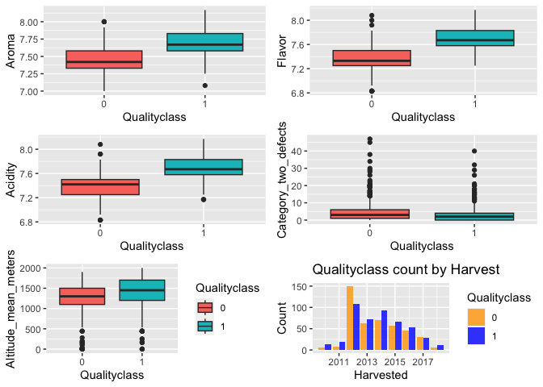

Groupwork2
================
2023-03-15

## 数据清理（coffee是清理掉NA,Taiwan和异常值的数据）

``` r
library(tidyverse)
```

    ## ── Attaching core tidyverse packages ──────────────────────── tidyverse 2.0.0 ──
    ## ✔ dplyr     1.1.0     ✔ readr     2.1.4
    ## ✔ forcats   1.0.0     ✔ stringr   1.5.0
    ## ✔ ggplot2   3.4.1     ✔ tibble    3.1.8
    ## ✔ lubridate 1.9.2     ✔ tidyr     1.3.0
    ## ✔ purrr     1.0.1     
    ## ── Conflicts ────────────────────────────────────────── tidyverse_conflicts() ──
    ## ✖ dplyr::filter() masks stats::filter()
    ## ✖ dplyr::lag()    masks stats::lag()
    ## ℹ Use the ]8;;http://conflicted.r-lib.org/conflicted package]8;; to force all conflicts to become errors

``` r
library(readxl)
coffee.data <- read.csv("/Users/sunyazhu/Desktop/University of Glasgow/R program/AllDatasetsR/coffee.csv")
coffee <- na.omit(coffee.data)
coffee<- subset(coffee, country_of_origin != 'Taiwan')
coffee
```

Qualityclass作为分类变量

``` r
coffee$Qualityclass <- as.integer(coffee$Qualityclass == "Good")
coffee
```

清除异常值

``` r
quantiles_aroma <- quantile(coffee.data$aroma,probs=c(0.25,0.75),na.rm=FALSE)
IQR_aroma <- IQR(coffee$aroma)
Lower_aroma <- quantiles_aroma[1]-1.5*IQR_aroma
Upper_aroma <- quantiles_aroma[2]+1.5*IQR_aroma
coffee<- subset(coffee,coffee$aroma>Lower_aroma & coffee$aroma< Upper_aroma)

quantiles_flavor <- quantile(coffee$flavor,probs=c(0.25,0.75),na.rm=FALSE)
IQR_flavor <- IQR(coffee$flavor)
Lower_flavor <- quantiles_flavor[1]-1.5*IQR_flavor
Upper_flavor <- quantiles_flavor[2]+1.5*IQR_flavor
coffee<- subset(coffee,coffee$flavor>Lower_flavor & coffee$flavor< Upper_flavor)

quantiles_acidity <- quantile(coffee$acidity,probs=c(0.25,0.75),na.rm=FALSE)
IQR_acidity <- IQR(coffee$acidity)
Lower_acidity <- quantiles_acidity[1]-1.5*IQR_acidity
Upper_acidity <- quantiles_acidity[2]+1.5*IQR_acidity
coffee<- subset(coffee,coffee$acidity>Lower_acidity & coffee$acidity< Upper_acidity)
coffee
```

存储数据清理后的文件（存储后的文件名为coffee_clean.csv）

``` r
write.csv(coffee,file="/Users/sunyazhu/Desktop/University of Glasgow/R program/AllDatasetsR/coffee_clean.csv",row.names=FALSE)
```

## 标准化数据（coffee里储存的是标准化后的数据）

``` r
## 创建一个逻辑向量，用于确定数据框 coffee 中哪些列包含数值型数据。它使用函数sapply判断每个列的数据类型是否为数值型。
numeric_cols <- sapply(coffee,is.numeric)
## 将数据框 coffee 中只包含数值型数据的列提取出来，赋值给新的数据框 numeric_coffee
numeric_coffee <- coffee[,numeric_cols]
## 将 numeric_coffee 中的数值型数据进行标准化处理，得到新的数据框 scaled_coffee。标准化处理是为了将不同变量的数据范围转化为相同的尺度，方便进行比较。
scaled_coffee <- as.data.frame(scale(numeric_coffee))
## 将原数据框 coffee 中的 category_two_defects 列添加到 scaled_coffee 中。
scaled_coffee$category_two_defects <- coffee$category_two_defects
## 将标准化后的数据框 scaled_coffee 中的数值型数据赋值回原数据框 coffee 中对应的列，覆盖原来的数据。
coffee[,numeric_cols] <- scaled_coffee
coffee
```

## correlation（用的标准化前的data——coffee.clean）

    ##                            aroma      flavor      acidity category_two_defects
    ## aroma                 1.00000000  0.67160282  0.538079249          -0.19698110
    ## flavor                0.67160282  1.00000000  0.705622108          -0.23495703
    ## acidity               0.53807925  0.70562211  1.000000000          -0.16888150
    ## category_two_defects -0.19698110 -0.23495703 -0.168881503           1.00000000
    ## altitude_mean_meters -0.03490461 -0.02777236 -0.006467399          -0.02396095
    ## harvested            -0.03412132  0.04100676  0.047885262          -0.13277330
    ## Qualityclass          0.59321981  0.66766788  0.604611195          -0.14226533
    ##                      altitude_mean_meters   harvested Qualityclass
    ## aroma                        -0.034904613 -0.03412132   0.59321981
    ## flavor                       -0.027772358  0.04100676   0.66766788
    ## acidity                      -0.006467399  0.04788526   0.60461119
    ## category_two_defects         -0.023960951 -0.13277330  -0.14226533
    ## altitude_mean_meters          1.000000000  0.07402986  -0.05075134
    ## harvested                     0.074029856  1.00000000   0.03792407
    ## Qualityclass                 -0.050751344  0.03792407   1.00000000

绘制箱图

    ## 
    ## 载入程辑包：'gridExtra'

    ## The following object is masked from 'package:dplyr':
    ## 
    ##     combine

    ## List of 1
    ##  $ legend.position: chr "none"
    ##  - attr(*, "class")= chr [1:2] "theme" "gg"
    ##  - attr(*, "complete")= logi FALSE
    ##  - attr(*, "validate")= logi TRUE

    ## Warning: Removed 24 rows containing non-finite values (`stat_boxplot()`).

<!-- -->

## 建模

    ## Analysis of Deviance Table
    ## 
    ## Model 1: Qualityclass ~ aroma + flavor + acidity
    ## Model 2: Qualityclass ~ aroma * flavor + acidity
    ## Model 3: Qualityclass ~ aroma + flavor * acidity
    ## Model 4: Qualityclass ~ aroma * acidity + flavor
    ## Model 5: Qualityclass ~ aroma * flavor + aroma * acidity
    ## Model 6: Qualityclass ~ aroma * flavor + acidity * flavor
    ## Model 7: Qualityclass ~ aroma * acidity + flavor * acidity
    ## Model 8: Qualityclass ~ aroma * flavor + acidity * flavor + acidity * 
    ##     aroma
    ## Model 9: Qualityclass ~ aroma * flavor * acidity
    ##   Resid. Df Resid. Dev Df Deviance
    ## 1       895     560.73            
    ## 2       894     556.92  1   3.8068
    ## 3       894     559.31  0  -2.3874
    ## 4       894     559.35  0  -0.0387
    ## 5       893     556.16  1   3.1888
    ## 6       893     555.58  0   0.5774
    ## 7       893     558.13  0  -2.5544
    ## 8       892     555.07  1   3.0631
    ## 9       891     554.98  1   0.0890

    ## 
    ## Call:
    ## glm(formula = Qualityclass ~ aroma * flavor * acidity, family = binomial(link = "logit"), 
    ##     data = coffee.clean)
    ## 
    ## Deviance Residuals: 
    ##     Min       1Q   Median       3Q      Max  
    ## -3.3244  -0.2890   0.0973   0.4774   2.4013  
    ## 
    ## Coefficients:
    ##                       Estimate Std. Error z value Pr(>|z|)
    ## (Intercept)          -3907.418   9756.355  -0.400    0.689
    ## aroma                  463.113   1268.246   0.365    0.715
    ## flavor                 483.055   1281.085   0.377    0.706
    ## acidity                441.778   1294.546   0.341    0.733
    ## aroma:flavor           -57.411    166.499  -0.345    0.730
    ## aroma:acidity          -52.376    168.286  -0.311    0.756
    ## flavor:acidity         -54.628    169.950  -0.321    0.748
    ## aroma:flavor:acidity     6.507     22.089   0.295    0.768
    ## 
    ## (Dispersion parameter for binomial family taken to be 1)
    ## 
    ##     Null deviance: 1245.07  on 898  degrees of freedom
    ## Residual deviance:  554.98  on 891  degrees of freedom
    ## AIC: 570.98
    ## 
    ## Number of Fisher Scoring iterations: 8

    ## [1] 568.7271

    ## [1] 566.9203

    ## [1] 569.3077

    ## [1] 569.3465

    ## [1] 568.1577

    ## [1] 567.5803

    ## [1] 570.1348

    ## [1] 569.0716

    ## [1] 570.9826

# test
dsadasdasd

# lalala